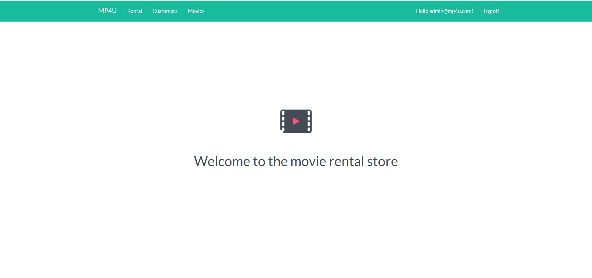
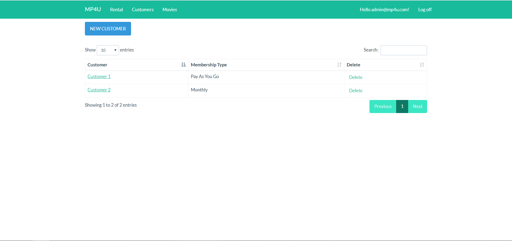
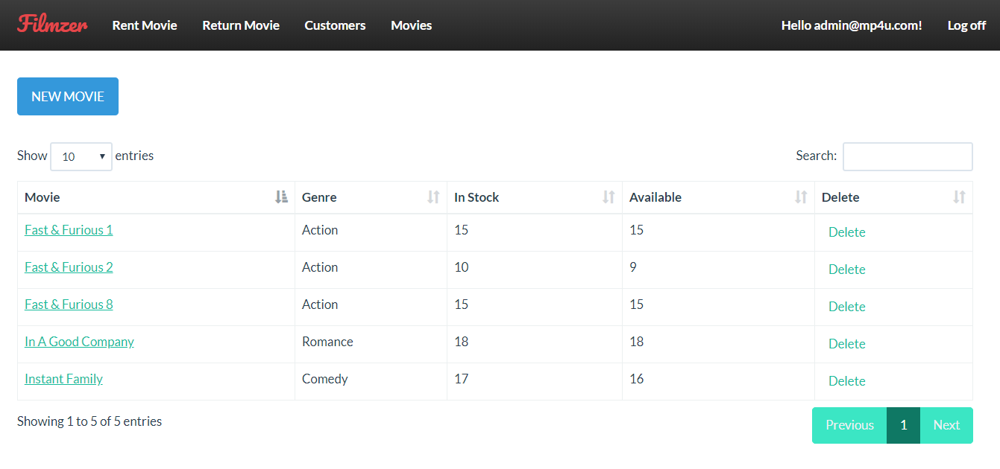
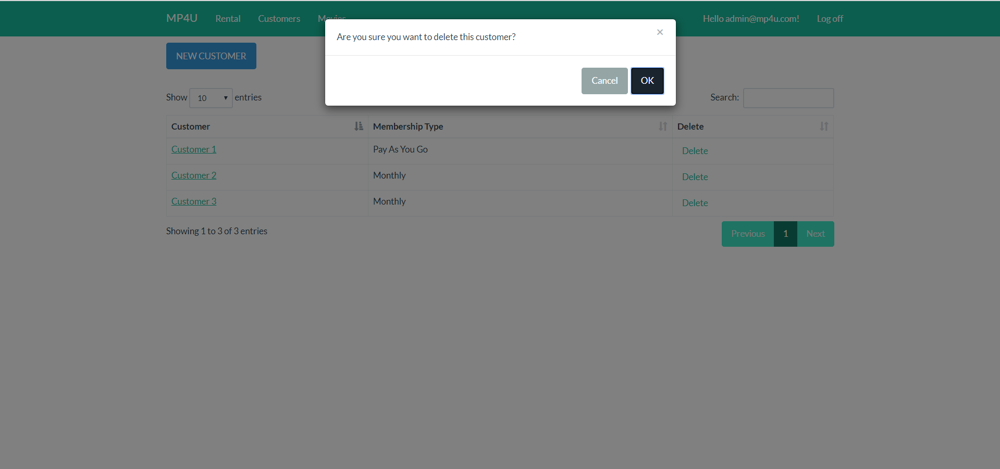
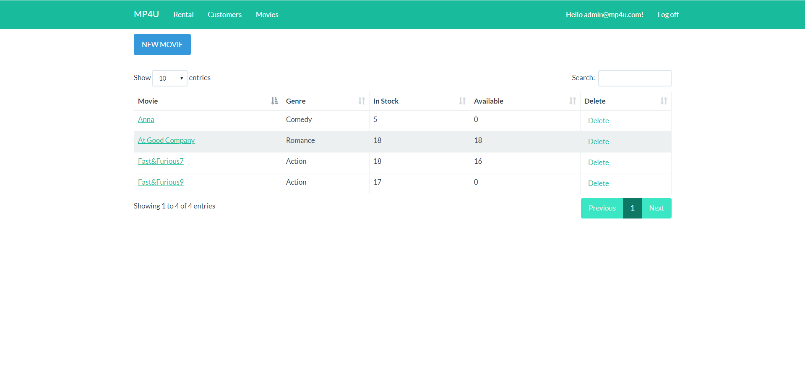
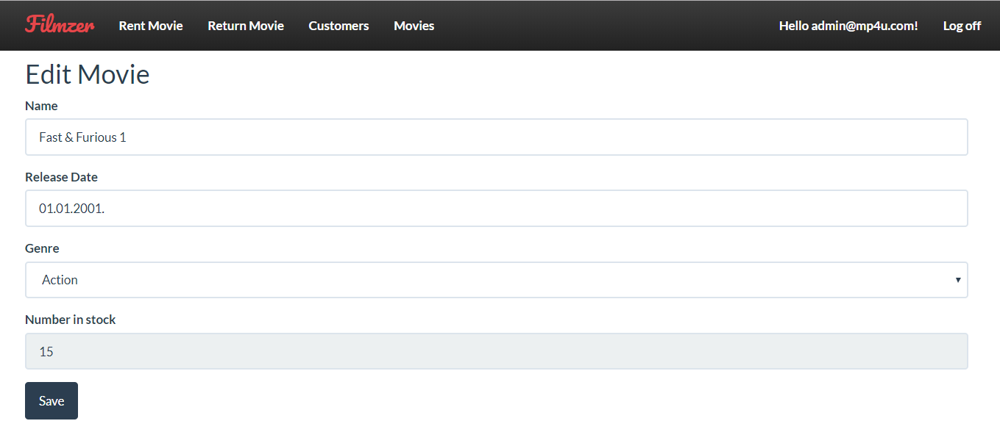
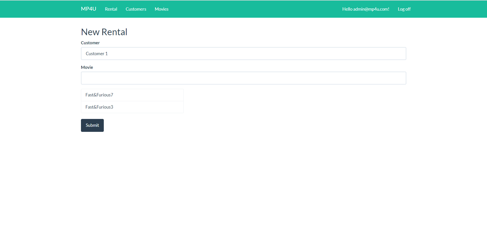
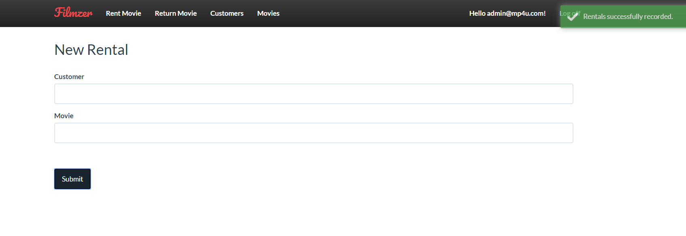

# MP4U Application

Web application for movie rental store. Application is developed based on Mosh Hamedani Udemy course.

## Screenshots
 
 
 

 
 
 

## Getting Started

These instructions will get you a copy of the project up and running on your local machine for development and testing purposes.

### Prerequisites

- .NET Framework [https://dotnet.microsoft.com/download/dotnet-framework/]
- Microsoft SQL Server Express [https://www.microsoft.com/en-us/sql-server/sql-server-editions-express]
- Visual Studio IDE [https://visualstudio.microsoft.com/vs/]

### Installing Backend

1. Open .sln file using Visual Studio IDE
2. Build the solution to install dependencies
3. Database connection string can be updated in Web.config file
5. Run the application
 
## Built With

* .NET Framework [https://dotnet.microsoft.com/download/dotnet-framework/] - The web framework used for exposing APIs

## Authors

Slobodan Cvetkovic [https://github.com/slobodanc93]
