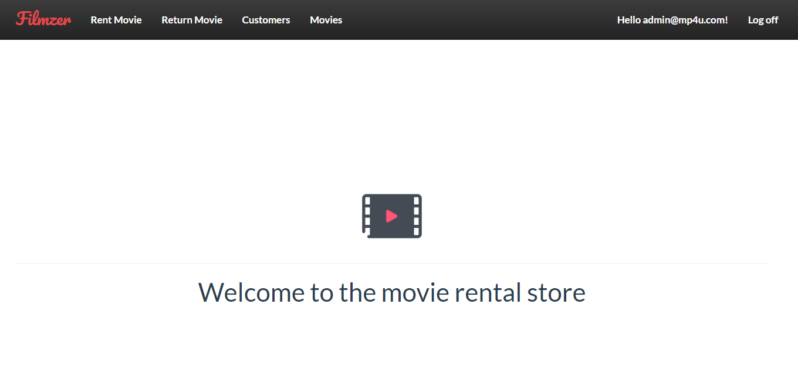
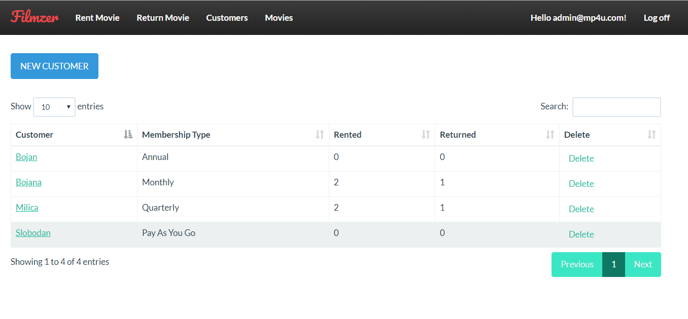
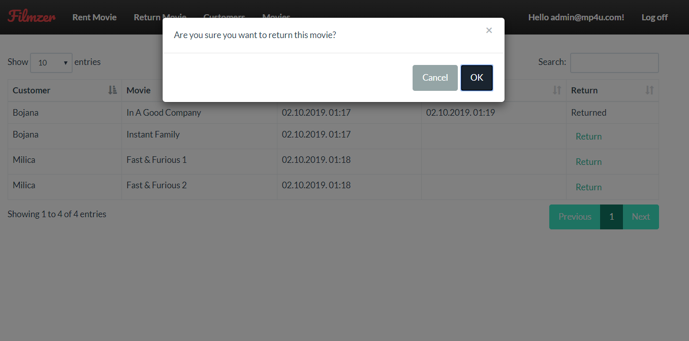
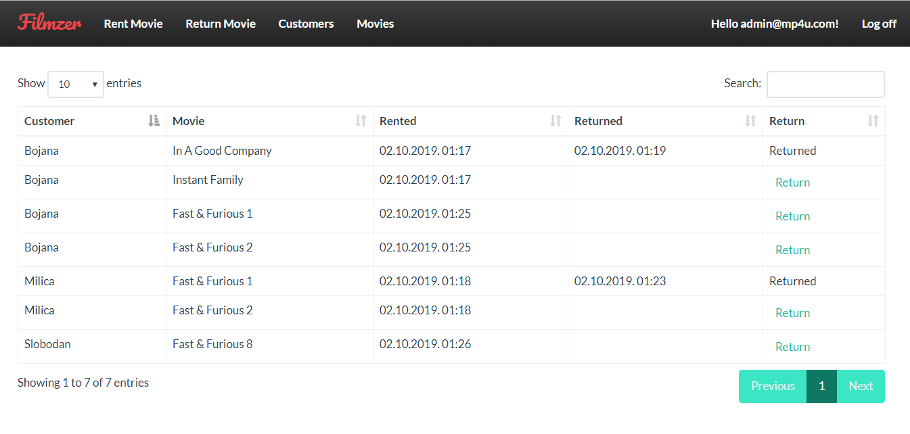
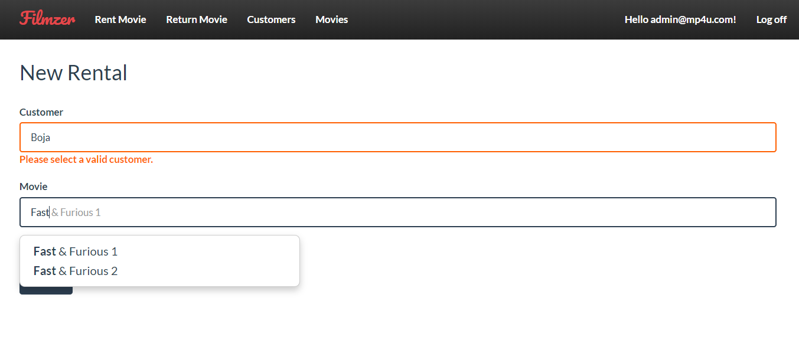

# Movies Rental Application

Web application for movie rental store. Application is developed based on Mosh Hamedani Udemy course, but with some additional functionalities and different look and feel. 
Main features:
1. Customers - add new customer or search, sort and delete existing ones
2. Movies - add new movie or search, sort and delete existing ones (not valid for guest users as they have readonly access)
3. Rental - Customer can rent one or more movies and that is saved in database.
4. Return - List of all rentals where movie can be returned

## Screenshots
 
 
 

 
 
 

## Getting Started

These instructions will get you a copy of the project up and running on your local machine for development and testing purposes.

### Prerequisites

- [.NET Framework](https://dotnet.microsoft.com/download/dotnet-framework/)
- [Microsoft SQL Server Express](https://www.microsoft.com/en-us/sql-server/sql-server-editions-express)
- [Visual Studio IDE](https://visualstudio.microsoft.com/vs/)

### Installing Backend

1. Open .sln file using Visual Studio IDE
2. Build the solution to install dependencies
3. Database connection string can be updated in Web.config file
5. Run the application
 
## Built With

[.NET Framework 4.7](https://dotnet.microsoft.com/download/dotnet-framework/)

## Authors

[Slobodan Cvetkovic](https://github.com/slobodanc93)
